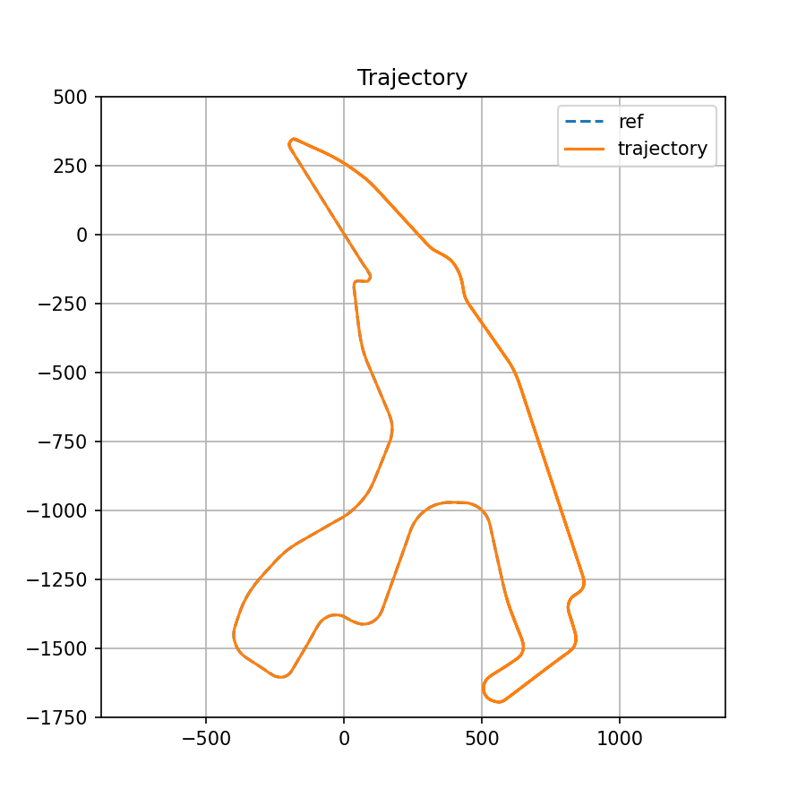
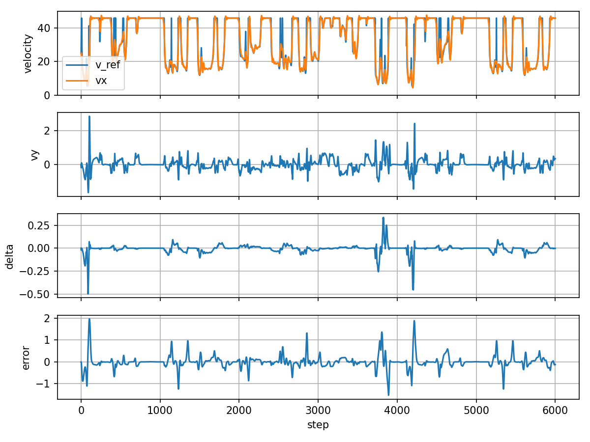
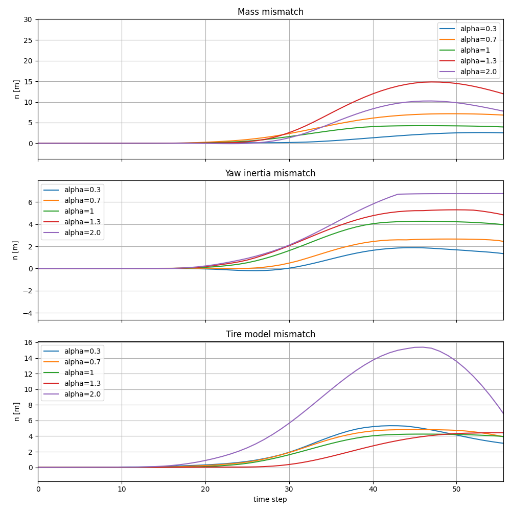

# Vehicle Dynamics(bicycle model) + iLQR
## CEL

### 1. Model bazowy [(commonroad-vehicle-models)](https://gitlab.lrz.de/tum-cps/commonroad-vehicle-models)

### 2. Model dynamiczny [(paper)](https://arxiv.org/pdf/2003.04882)

### 3. Model opon Pacejka

### 4. Sterowanie iLQR

### 5. Narzędzia i symulacja
* Python
* NumPy – obliczenia macierzowe
* Matplotlib – wizualizacja (trajektoria, błędy, sterowania)
* [commonroad-vehicle-models](https://gitlab.lrz.de/tum-cps/commonroad-vehicle-models) – parametru pojazdu
* [pytorch](https://github.com/pytorch/pytorch) – obliczanie pochodnych do iLQR

## Rezultaty
### Wykresu symulacji całego okrążenia [(main_lqr.py)](main_lqr.py)
**Tor jazdy pojazdu / [trajektoria referencyjna](https://github.com/TUMFTM/racetrack-database):**  

**Prędkosci vx(prędkość wzdłużna), vy(prędkość boczna), delta(kąt skrętu kierownicy) oraz błąd pozycji względem toru:**  

### Błąd symulacji przy różnych parametrach modelu w regulatorze iLQR [(main_lqr_parameters.py)](main_lqr_parameters.py)
W analizie wrażliwości zmieniano masę, moment bezwładności lub parametry Pacejki opon, skalując je współczynnikiem alpha:

